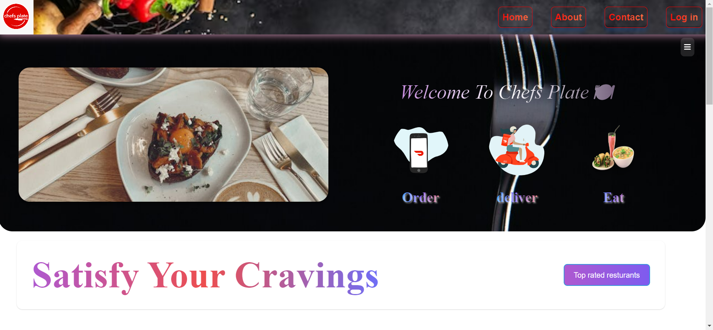
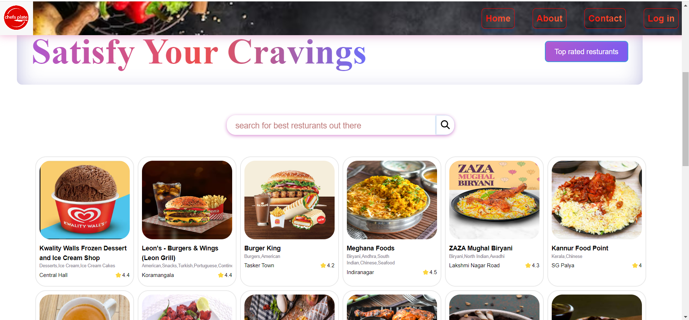
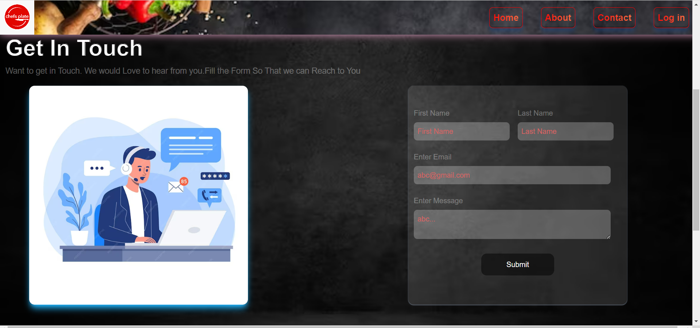

# Hi this is Saurav jha
- This is React based project
- Project Title:chefPlate

# About this project
- "Chefs Plate"
            is a React-based web application created for practice and
            demonstration. The project features a
              configuration-driven user interface
            and integrates
              the Swiggy API
            to fetch restaurant and menu data. Serving as a demo website for a
            food delivery service, it showcases essential functionalities like a
              configurable UI, search feature, and contact forms, all in a
              single-page application format.
            

- Project Link : <a href="https://chefplate.netlify.app/"> Click here </a>

# Important Note:
-If you encounter shimmering UI instead of menus when clicking on restaurants, it's likely due to a CORS (Cross-Origin Resource Sharing) issue. To ensure uninterrupted access to our delectable offerings, we recommend using a VPN like Proton VPN.

